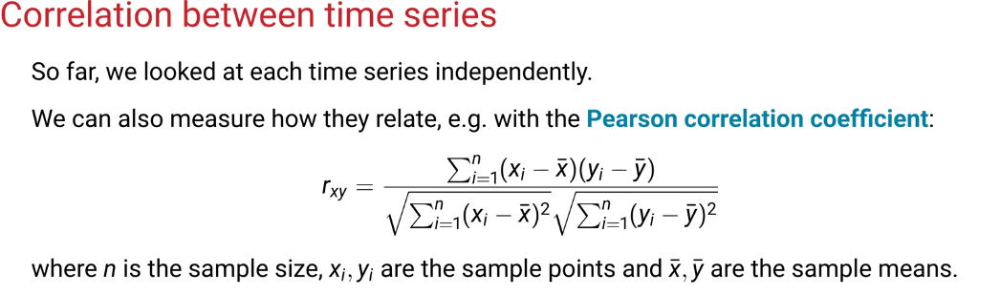
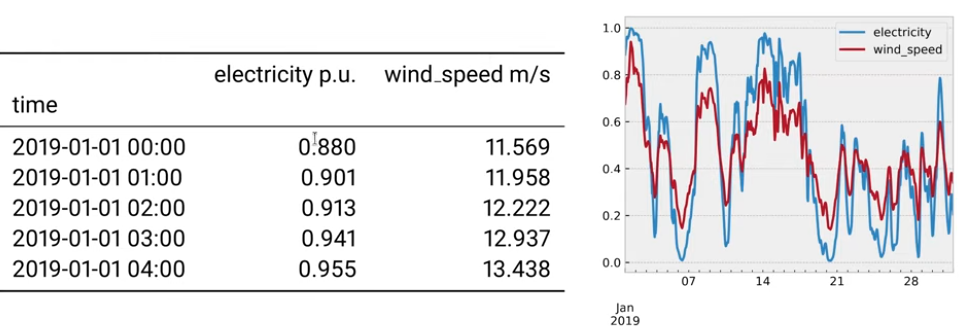
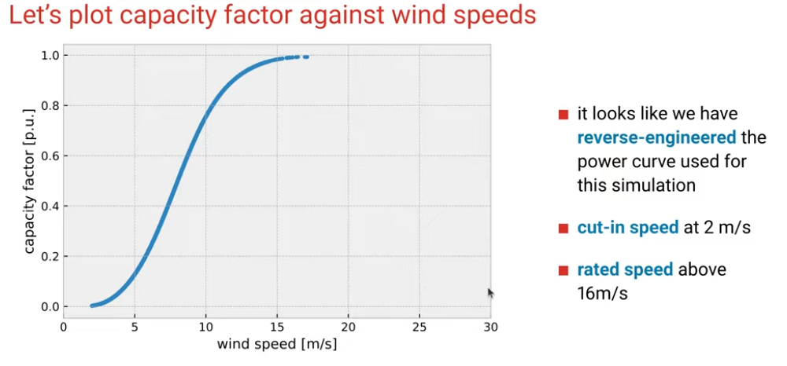
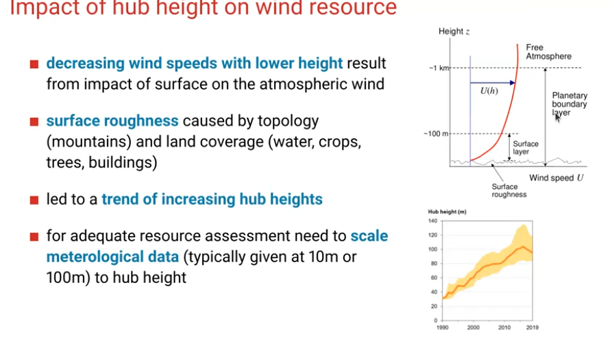
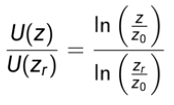
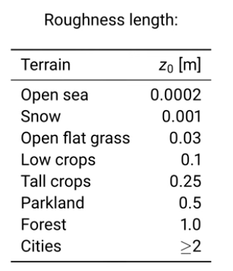
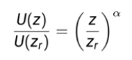
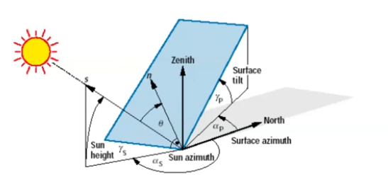

# Notes for Energy System Modelling Lectures

Class on youtube by Fabian Neumann: [here](https://www.youtube.com/watch?v=BqvbdtDrW7g&list=PL9_USGH2eQEOpSeN9kf-7Q8hfIC7MFa4J)

## Lecture 1

- Global wind atlas can be used for wind power density modeling
- Global solar atlas shows the solar potential
- Renewables ninja provides time series data for Solar PV, wind, heating and cooling, and weather
- Global Energy monitor provides fantastic data for research related work on all aspects of energy [here](https://globalenergymonitor.org/projects/private-equity-tracker/)

## Lecture 2

- Try running cases with https://model.energy/
- If you take a demand/load curve (hourly) across a year and reformat it/sort it by the scalar values you get a load duration curve (which shows the percentage of the year, the demand is above a certain value)
-We can use fourier analysis tp decompose a periodic signal into simpler sine waves
    - Every periodic signal can be broken down into a sum of sine waves with different frequencies and amplitudes
    -FFT is helpful for this
- Onshore wind is much more variable than offshore and solar, and there are some what seasonal patterns
- There are weekly or 'synoptic' weather patters that could appear in wind on shore patterns
- Offshore wind has higher and steadier capacity factors than onshore wind
- Open energy prices is a good source of information https://openenergytracker.org/en/
- We can look at time series correlation between two independent time series via the pearson correlation

## Workshop #1,2,3

- Python, numpy and pandas intro

## Lecture 3

- Wind power grows in proportion to v^3
- You get wind production data by either measuring the production at an actual site, or by modeling production at a location based on the wind profile we have
- We take the time series wind speeds at a hub height (120m for example) at each location. In theory, power in the wind grows in proportion to v^3. High wind speeds are super rare so turbines larger than a certain point are not economical

- Capacity factor is the actual production / nameplate capacity 

- different wind turbines have varying power curves, so there are ones that do better in low wind vs medium, etc. Newest offshore turbines are rated for 15 MW and have a typical 15 MW rate capacity

- 

- Two common laws relate to wind speeds at height z to a known ref height zr

    - Log law: 
    
        

        - z0 is the terrain dependent roughness length as follows: 
    
    - Power law: 
        
        
        - Power law assumes $\alpha$ = 1/7

- We get solar PV time series by taking weather data for solar radiation (irradiation) at each location in W/m^2. THere needs to be some calcs to account for the angles and energy conversions (losses, outside temp, etc) 

- There are different ways to simulate PV model output, like the Huld model to estimate PV power output from irradiance and temp in europe

https://www.youtube.com/watch?v=c1HyDcuD2zM&list=PL9_USGH2eQEOpSeN9kf-7Q8hfIC7MFa4J&index=2

https://fneum.github.io/data-science-for-esm/dsesm/workshop-python/

## Open mod lecture to follow later
https://www.youtube.com/watch?v=Acl5gonFMx4
https://www.youtube.com/watch?v=igGdc3UTj-Q